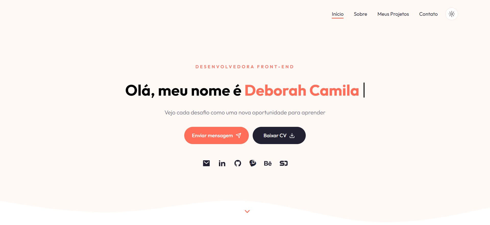
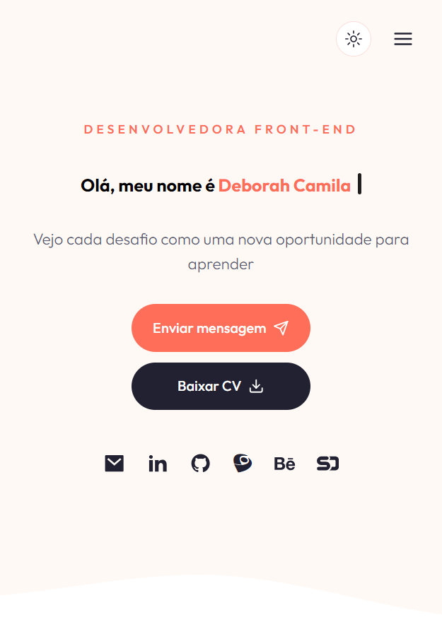

> O template desse projeto foi inspirado na vídeo aula de [Cristian Mihai](https://www.youtube.com/@cristianmihai01), porém fiz algumas alterações e implementações.

## 👋 Olá!

Este é o meu projeto de portfólio que tem como objetivo apresentar um pouco sobre mim, as áreas em que trabalho, além de disponibilizar os últimos projetos que desenvolvi, meu currículo e as minhas principais redes sociais para contato.
O projeto é **responsivo**, contém **dark mode** e algumas **animações**.

## Tecnologias usadas

Esse projeto foi desenvolvido com as seguintes tecnologias:

- JavaScript;
- React.js;
- Next.js 14;
- Shadcn UI;
- Tailwind CSS.

## Preview Desktop

## Preview Mobile

